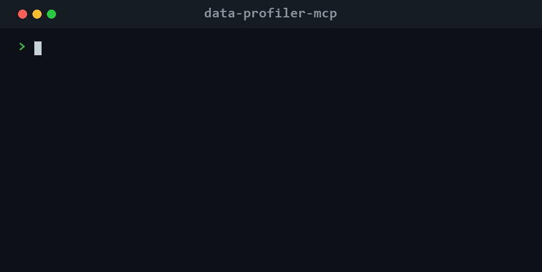

# data-profiler-mcp

<!-- mcp-name: io.github.haiiibin/data-profiler-mcp -->

[](https://github.com/haiiibin/data-profiler-mcp/actions/workflows/ci.yml)
[](https://pypi.org/project/data-profiler-mcp/)
[](https://pypi.org/project/data-profiler-mcp/)
[](https://pypi.org/project/data-profiler-mcp/)
[](https://glama.ai/mcp/servers/haiiibin/data-profiler-mcp)
[](https://github.com/punkpeye/awesome-mcp-servers)
[](LICENSE)

> An [MCP](https://modelcontextprotocol.io) server that lets an LLM understand any tabular data file: point it at a CSV, Parquet, Excel or JSON file and get schema, distributions, data-quality flags and dtype suggestions back as structured JSON.

Stop pasting `df.head()` and `df.info()` into chat. Ask your assistant *"profile `sales.csv`"* and it reads the file itself, then tells you what is in it, what is wrong with it, and how to load it more efficiently.



Works with **Claude Desktop**, **Claude Code**, **Cursor**, or any MCP-compatible client.

---

## Features

Six focused tools, all returning clean JSON:

| Tool | What it does |
|---|---|
| `profile_dataset` | One-call overview: shape, memory, missing-value summary, duplicate rows, a per-column summary, and plain-language quality flags. |
| `preview_data` | The first / last / a random sample of `n` rows as real records. |
| `column_stats` | Deep dive on one column: full percentiles, skew/kurtosis, outliers (IQR), a histogram, or top values + string lengths for text. |
| `detect_quality_issues` | A data-quality audit: duplicates, high-missing and constant columns, numbers stored as text, mixed-type columns, whitespace padding, likely IDs, grouped by severity. |
| `suggest_dtypes` | Memory-saving / type-fixing recommendations (text to numeric, low-cardinality to `category`, integer/float downcasting) with estimated savings. |
| `compare_datasets` | Diff two files: added/removed columns, dtype changes, row-count delta, and per-column null-rate and mean side by side. |

Supported formats: **CSV, TSV, Parquet, Excel (`.xlsx`/`.xls`), JSON and JSON Lines**. Large files are read up to a row cap and clearly flagged as sampled.

No dataset at hand? [`examples/sample.csv`](examples/sample.csv) is a small sales export with deliberate quality issues (missing regions, a duplicate row, a constant column, whitespace padding) -- ask your assistant to *"profile examples/sample.csv"* and see what it flags.

---

## Install

Requires Python 3.10+.

```bash
# with uv (recommended)
uv tool install data-profiler-mcp

# or with pip
pip install data-profiler-mcp
```

Or run it straight from source without installing:

```bash
git clone https://github.com/haiiibin/data-profiler-mcp
cd data-profiler-mcp
uv run data-profiler-mcp
```

---

## Configure your client

### Claude Desktop

Edit `claude_desktop_config.json`
(macOS: `~/Library/Application Support/Claude/`, Windows: `%APPDATA%\Claude\`) and add:

```json
{
  "mcpServers": {
    "data-profiler": {
      "command": "data-profiler-mcp"
    }
  }
}
```

Running from source instead of installing? Point it at the checkout:

```json
{
  "mcpServers": {
    "data-profiler": {
      "command": "uv",
      "args": ["--directory", "/absolute/path/to/data-profiler-mcp", "run", "data-profiler-mcp"]
    }
  }
}
```

Restart Claude Desktop and the tools appear under the plug icon.

### Claude Code

```bash
claude mcp add data-profiler -- data-profiler-mcp
```

---

## Usage

Once connected, just talk to your assistant:

- *"Profile `~/data/sales_2025.csv` and tell me what's in it."*
- *"Are there any data-quality problems in `customers.parquet`?"*
- *"Show me 20 random rows from `events.jsonl`."*
- *"Give me full stats for the `revenue` column, including outliers."*
- *"How can I shrink this DataFrame's memory usage?"*
- *"What changed between `snapshot_jan.csv` and `snapshot_feb.csv`?"*

### Example: `profile_dataset`

```jsonc
{
  "file": { "name": "sample.csv", "format": "csv", "size_human": "14.2 KB" },
  "shape": { "rows": 201, "columns": 13, "sampled": false },
  "memory_usage_human": "78.4 KB",
  "missing_summary": { "total_missing_cells": 561, "pct_missing": 21.5, "columns_with_missing": 3 },
  "duplicate_rows": { "count": 1, "pct": 0.5 },
  "columns": [
    {
      "name": "price", "dtype": "float64", "inferred_type": "float",
      "non_null": 201, "null": 0, "unique": 51,
      "stats": { "min": 0.0, "max": 100000.0, "mean": 521.3, "median": 24.0 }
    }
  ],
  "quality_flags": [
    "[high] empty_col: Column is entirely empty (all values missing).",
    "[warning] const: Column holds a single constant value; it carries no information.",
    "[warning] numeric_text: Every value parses as a number but the column is stored as text."
  ]
}
```

### Example: `detect_quality_issues`

```jsonc
{
  "issue_count": 8,
  "severity_counts": { "high": 2, "warning": 4, "info": 2 },
  "issues": [
    { "column": "empty_col", "issue": "all_missing", "severity": "high",
      "detail": "Column is entirely empty (all values missing)." },
    { "column": "numeric_text", "issue": "numeric_stored_as_text", "severity": "warning",
      "detail": "Every value parses as a number but the column is stored as text." }
  ]
}
```

---

## How it works

The server is built on [FastMCP](https://github.com/modelcontextprotocol/python-sdk) and reads files with pandas (plus pyarrow for Parquet and openpyxl for Excel). Every tool returns a plain, JSON-serializable dict, with NumPy scalars, `NaN`/`inf` and timestamps normalized so the output is safe to hand straight back to a model. Nothing is written to disk and no data leaves your machine.

---

## Development

```bash
uv venv
uv pip install -e ".[dev]"
uv run pytest
```

---

## License

MIT. See [LICENSE](LICENSE).
